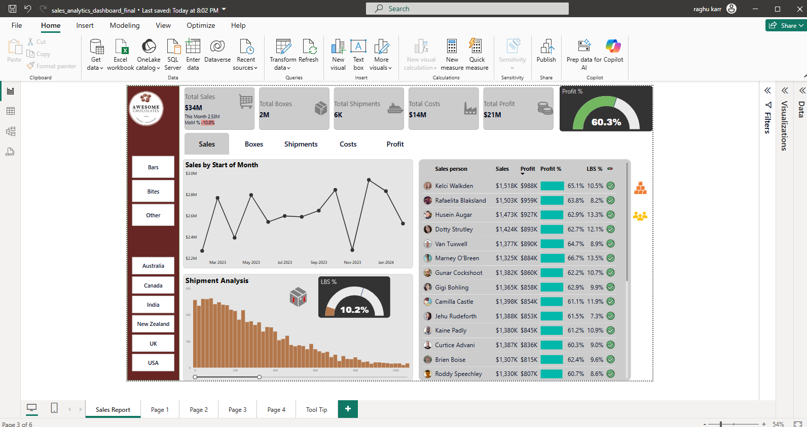

# 📊 Sales Analytics Dashboard — Power BI

This dashboard provides a comprehensive overview of global sales performance for a chocolate brand, helping decision-makers monitor revenue, profitability, and operational efficiency.

## 🔍 Key Features

- ✅ **Total KPIs**: Sales, Profit, Shipments, Boxes, LBS%
- 🌍 **Slicers**: Filter by Region (Australia, Canada, India, etc.) and Product Category (Bars, Bites, Other)
- 📈 **Monthly Trend Analysis**: Line chart tracking sales by start of month
- 🚚 **Shipment Analysis**: Histogram showing shipment load distribution with LBS efficiency
- 👥 **Salesperson Insights**: Dynamic table with sales, profit, profit %, and LBS%
- 📊 **KPI Cards**: Highlights MoM performance, profit percentage, and interactive gauge

## 🛠️ Tools Used

- Power BI
- DAX
- Data Modeling
- Custom Visuals

## 📂 Dataset

Simulated chocolate sales data across 6 global regions

Full Dashboard [App PowerBI link] (https://app.powerbi.com/view?r=eyJrIjoiOGU3NTg3MjQtMDQ2YS00NzQxLWIwODItOGY4ZjE3YWRlZmI5IiwidCI6IjZhZGZkYmY3LTcxMGItNDYxNi05YWFjLTA5NTAxMjU0YTg4MyIsImMiOjJ9)

